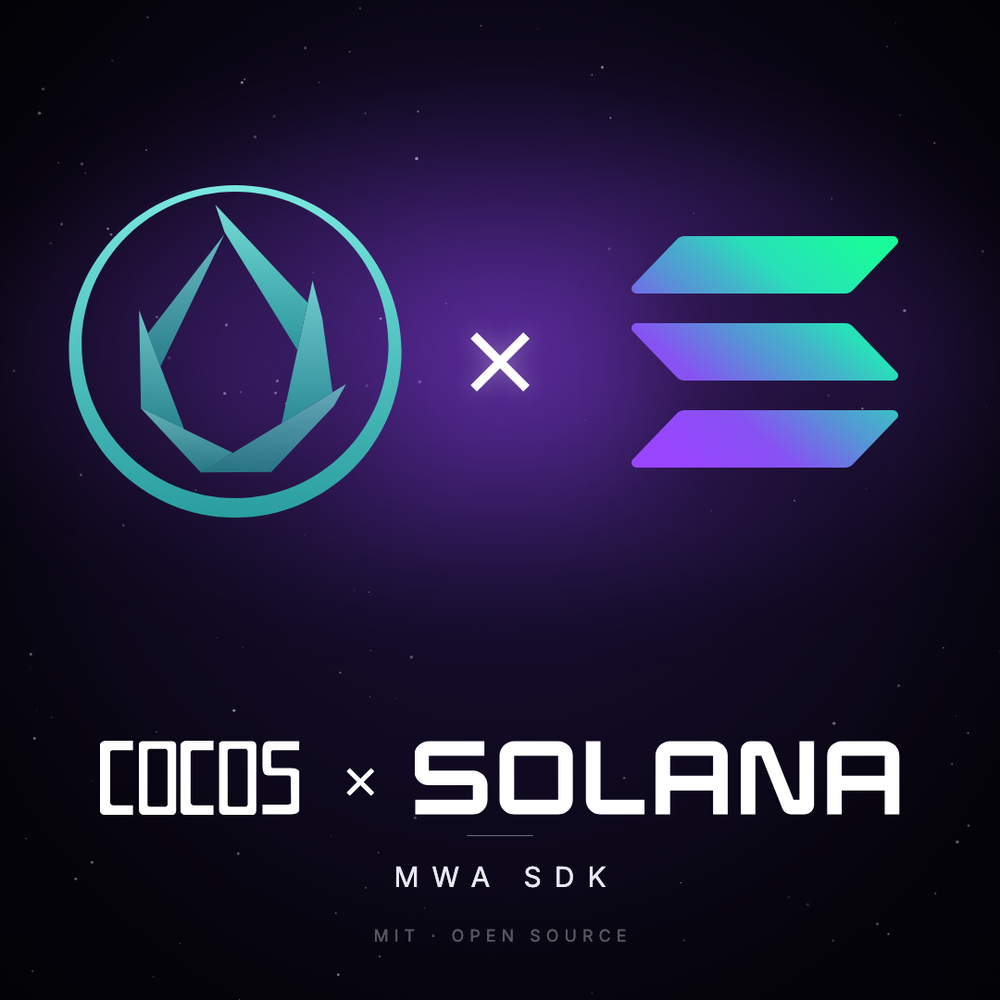

<p align="center">
  
</p>

<h1 align="center">Cocos Creator MWA SDK for Solana</h1>

<p align="center">
  <strong>The first production-ready bridge between Cocos Creator and Solana.</strong><br/><br/>
  Cocos powers 1.7M developers and a massive share of Asia's mobile games.<br/>
  Until now, none of them could build on Solana.<br/><br/>
  This SDK changes that. Hardware-verified on Solana Seeker. MIT-licensed. Open source.
</p>

<p align="center">
  
  
  
  
  
</p>

---

## Two branches, one SDK

The SDK lives at `assets/scripts/walletService/` and is **identical on both branches**. They differ only in what's built *on top* of it:

| Branch | What's built on the SDK | What you'll see |
|---|---|---|
| [`master`](../../tree/master) | **Example App.** A clean Cocos scene that exercises every MWA 2.0 method (`authorize`, `SIWS`, batch `signMessages`, `signAndSendTransactions`, `deauthorize`, `getCapabilities`, etc.) against every supported wallet. | The SDK alone, every API method visible end-to-end. |
| [`betting-duel`](../../tree/betting-duel) | **Token Duel.** A real-time portfolio-race game with an on-chain Anchor escrow program on devnet. Pick 3 tokens, stake SOL, race for 60 seconds, settle on-chain. | The SDK driving a production-shaped game. |

> 🏆 **Colosseum Frontier 2026 hackathon submission**: the [`betting-duel`](../../tree/betting-duel) branch. SDK is the product, Token Duel is the proof.

A complete Solana Mobile Wallet Adapter (MWA) 2.0 SDK for Cocos Creator 3.8+, bringing full MWA API parity to the dominant mobile game engine in Asia (1.7M+ developers, zero prior Solana integration). Built and tested on Solana Seeker hardware with Phantom, Solflare, Backpack, Jupiter, and Seed Vault. See [`PITCH.md`](PITCH.md) for the market thesis.

---

## Why this matters

Cocos is the dominant mobile game engine in Asia: 40 percent of China's mobile games, 60 percent of Korea's top 10, $5.56B of WeChat mini-games. Until this SDK shipped, those 1.7M developers had no path to Solana.

This SDK opens Solana to an entirely new developer ecosystem. Token Duel, on the [`betting-duel`](../../tree/betting-duel) branch, is what that future looks like: a real on-chain game built on top of the SDK. Proof, not promise.

---

## Features

| Method | Description | Status |
|--------|-------------|--------|
| `authorize` | Connect wallet via OS picker or targeted package | Verified |
| `authorizeSiws` | MWA 2.0 Sign In With Solana (one-shot connect + prove ownership) | Verified |
| `reauthorize` | Silent reconnect with cached auth token | Verified |
| `deauthorize` | Disconnect wallet session (sends MWA RPC, not just local clear) | Verified |
| `signMessages` | Sign arbitrary messages with Ed25519 | Verified |
| `signTransactions` | Sign transactions without broadcast | Verified |
| `signAndSendTransactions` | Sign + broadcast to Solana, returns tx signature | Verified |
| `getCapabilities` | Non-privileged query for wallet limits and features | Verified |
| `deleteAccount` | Wallet-confirmed account deletion with biometric | Verified |

### Additional Capabilities

- **Auth Caching:** Persistent token storage via `sys.localStorage` for silent reconnection across app restarts
- **Multi-Wallet Support:** Seed Vault (biometric), Phantom, Solflare, Backpack, Jupiter
- **Wallet Detection:** Detect installed MWA-compatible wallets by package name
- **Device Detection:** Identify Solana Mobile devices (Seeker, Saga)
- **Compound Commands:** `authorize_and_sign` (single-session biometric) and `sign_and_deauthorize` (delete flow)
- **Transaction Builder:** Zero-dependency binary serializer for memo, SOL transfer, and SPL token transfer
- **Deterministic Logging:** Every operation logs entry, parameters, results, and exit at both Java and TypeScript layers

## Architecture

```
TypeScript (Cocos Creator)          Java (Android Native)
─────────────────────────           ──────────────────────
MWAManager.ts                       MWABridgePlugin.java
  │ async/await API                   │ JsbBridge command router
  ▼                                   ▼
MWABridge.ts                        MWASessionManager.java
  │ JSON protocol over JsbBridge      │ LocalAssociationScenario
  ▼                                   ▼
native.bridge.sendToNative()        clientlib-ktx 2.0.3
                                      │ WebSocket + ECDH + AES-GCM
                                      ▼
                                    Wallet App (Phantom, Seed Vault, etc.)
```

Each MWA operation creates a fresh `LocalAssociationScenario` on a random ephemeral port (49152-65535), encrypted via ECDH key exchange. The JsbBridge protocol uses JSON commands with automatic request ID correlation and 60-second timeouts.

## Quick Start

### 1. Install Cocos Creator 3.8+

Download from [cocos.com/en/creator-download](https://www.cocos.com/en/creator-download).

### 2. Copy the SDK into your project

```
your-project/
  assets/
    solana-mwa/          <-- copy this directory
      scripts/
        MWAManager.ts
        MWABridge.ts
        MWATypes.ts
        AuthCache.ts
        AppIdentity.ts
        TransactionBuilder.ts
        SolanaRpc.ts
        Base58.ts
        MWAEvents.ts
```

### 3. Build for Android once

Project -> Build -> Android -> Build. This generates the `native/` directory.

### 4. Copy Java native layer

Copy the Java files into your native Android source:

```
native/engine/android/app/src/com/cocos/game/mwa/
  MWABridgePlugin.java
  MWASessionManager.java
  MWAIntentHelper.java
  WalletDetector.java
  AndroidToastHelper.java
```

### 5. Add dependencies

Add to `native/engine/android/app/build.gradle`:

```groovy
dependencies {
    implementation 'com.solanamobile:mobile-wallet-adapter-clientlib-ktx:2.0.3'
}
```

Add the Solana Mobile Maven repository:

```groovy
repositories {
    maven { url 'https://maven.solanamobile.com/releases' }
}
```

### 6. Patch AndroidManifest.xml

Add inside `<manifest>`:

```xml
<queries>
    <intent>
        <action android:name="android.intent.action.VIEW" />
        <category android:name="android.intent.category.BROWSABLE" />
        <data android:scheme="solana-wallet" />
    </intent>
</queries>
```

### 7. Initialize the bridge

In your `AppActivity.java` `onCreate()`:

```java
import com.cocos.game.mwa.MWABridgePlugin;

@Override
protected void onCreate(Bundle savedInstanceState) {
    super.onCreate(savedInstanceState);
    MWABridgePlugin.init(this);
}
```

### 8. Use the SDK

```typescript
import { MWAManager } from './solana-mwa/scripts/MWAManager';

// Connect
const result = await MWAManager.instance.authorize();

// Connect with SIWS (MWA 2.0)
const siwsResult = await MWAManager.instance.authorizeSiws('myapp.com', 'Sign in to MyApp');

// Sign a message
const sig = await MWAManager.instance.signMessage('Hello Solana!');

// Sign and send a transaction
const txSigs = await MWAManager.instance.signAndSendTransactions([serializedTx]);

// Get wallet capabilities
const caps = await MWAManager.instance.getCapabilities();

// Disconnect
await MWAManager.instance.deauthorize();
```

## Wallet Support

| Wallet | Connect | Sign | Sign & Send | Delete | Notes |
|--------|---------|------|-------------|--------|-------|
| Phantom | Yes | Yes | Yes | Yes | Full parity |
| Solflare | Yes | Yes | Yes | Yes | signMessage has known MWA bug |
| Backpack | Yes | Yes | Yes | Yes | Full parity |
| Jupiter | Yes | Yes | Yes | Yes | Full parity |
| Seed Vault | Yes | Yes | Yes | Yes | Biometric flow via compound commands |

## Debugging

All operations produce deterministic logs viewable via `adb logcat`:

```
adb logcat -s cocos-mwa MWAManager MWABridge MWASessionManager
```

Log format: `[TAG] method | PHASE key=value key2=value2`

Example flow:
```
[MWAManager] authorize | START is_connected=false authorizing=false
[MWASessionManager] authorize | START app=MyApp cluster=devnet
[MWASessionManager] authorize | scenario created port=52341
[MWASessionManager] authorize | client connected
[MWASessionManager] authorize | SUCCESS pubkey=7xKX...4bNr auth_token_len=87
[MWAManager] authorize | STATE_SET pubkey=7xKX...4bNr authToken_len=87 isConnected=true
[MWAManager] authorize | DONE connected=true | emitted MWA_AUTHORIZED
```

## Token Duel: Demo Game + Anchor Program

> Actively developed for the May 11 Colosseum submission. Commits land daily.

Bundled with the SDK: **Token Duel**, a Stack-Jump-style demo game that exercises the full MWA method surface against a real on-chain Anchor program. Pick a squad of 3 tokens from Solana's entire market → stake SOL → play tap-timing game where block widths are driven by your tokens' real 24-hour price deltas → settle on-chain. Every wallet prompt in the pitch video corresponds to a real program invocation.

Feature surface on the panel:
- **Live Birdeye feed:** Trending / Gainers / New-listings tabs with scrollable rows, symbol + price + 24h delta + async-loaded logos.
- **Search:** `cc.EditBox` with 500ms debounce into Birdeye's fuzzy search endpoint.
- **Squad picker:** 3 slots, tap feed rows to add, tap slots to clear.
- **Stake slider:** Continuous 0.001-0.1 SOL with snap-to chips.
- **On-chain leaderboard:** 4th tab "🏆 Top 10" reads the `Leaderboard` PDA live; top-10 by height, sort-insert-evict in the settle ix.
- **Single-tap commit:** `signAndSendTransaction` routes per wallet (Phantom/Jupiter native, Backpack sign+RPC fallback, others universal sign+RPC).

**Token Duel Anchor program (devnet):**
- Program ID: `14H1RLeqzU2rCnpnsLakVCtcmfZcuS4LvzwfhiY3AQbd`
- Pool PDA: `Gq2WfDRim2pu4x6FW3adpwMRah4uW46hNt3dTYeSFgp4`
- Leaderboard PDA: seeded `[b"leaderboard"]`. See `scripts/init-leaderboard.ts` bootstrap.
- Source: [`programs/token-duel/src/`](./programs/token-duel/src/)
- Explorer: https://explorer.solana.com/address/14H1RLeqzU2rCnpnsLakVCtcmfZcuS4LvzwfhiY3AQbd?cluster=devnet

**Instructions:**

| Instruction | Args | Purpose |
|---|---|---|
| `initialize_pool` | `fund_amount: u64` | Seed the protocol pool PDA (one-time admin setup) |
| `initialize_leaderboard` | (none) | Allocate the Leaderboard PDA zero-filled (one-time admin setup) |
| `commit` | `amount: u64, session_seed: u64` | Player stakes SOL into a per-session escrow PDA. Emits `SessionCommitted`. |
| `settle` | `height: u8` | Player claims payout by height tier + leaderboard insert-sort-evict. Emits `SessionSettled` + optional `LeaderboardInserted`. |

**PDA seed scheme:**
- Pool: `[b"pool"]`, singleton, protocol-owned
- Leaderboard: `[b"leaderboard"]`, singleton, holds top-10 entries
- Session: `[b"session", player.key(), session_seed.to_le_bytes()]`, per-round state
- Escrow: `[b"escrow", session.key()]`, per-round SOL vault

**Tier payout table** (enforced in `programs/token-duel/src/instructions/settle.rs`):

| Height | Tier | Payout |
|---|---|---|
| 0-10 | Forfeit | escrow → pool (stake) |
| 11-20 | Half | escrow → player (stake/2) + pool (stake/2) |
| 21-35 | Full | escrow → player (stake) |
| 36+ | Double | escrow → player (stake) + pool → player (stake) |

**Build + deploy:**

```bash
# First time: install Rust + Solana CLI + Anchor
curl --proto '=https' --tlsv1.2 -sSf https://sh.rustup.rs | sh -s -- -y
sh -c "$(curl -sSfL https://release.anza.xyz/stable/install)"
cargo install --git https://github.com/solana-foundation/anchor avm --force
avm install 0.31.1 && avm use 0.31.1

# From repo root
solana config set --url https://api.devnet.solana.com
solana airdrop 2   # or use https://faucet.solana.com

anchor build
anchor keys sync               # first-time only; rewrites declare_id! from generated keypair
anchor build                   # rebuild with correct program ID
anchor deploy --provider.cluster devnet

# Seed the protocol pool (one-off)
cd scripts && npm install
npm run smoke                  # also funds the pool on first run
```

**Run the smoke test suite:**

```bash
cd scripts
npm run smoke              # full happy-path: commit + settle (tier-1)
npm run smoke-backend      # verify AnchorBackend.ts bytes roundtrip through sign + RPC
npm run smoke-tiers        # all 4 tiers on-chain: forfeit / half / full / double
npm run smoke-negatives    # all 5 error paths: stake bounds, height OOR, double-settle, foreign-player
```

**Client integration:** `assets/token-duel/scripts/AnchorBackend.ts` builds commit/settle transactions as raw `Uint8Array` bytes (no `@coral-xyz/anchor` dep, hand-rolled discriminator + borsh). Feed those bytes into `MWAManager.signTransaction` / `signAndSendTransaction` and the wallet signs them unchanged.

## Sister Projects

- [godot-solana-mwa-example](https://github.com/mstevens843/godot-solana-mwa-example): Godot 4.x MWA example app
- [godot-solana-sdk](https://github.com/mstevens843/godot-solana-sdk): Godot SDK fork with MWA 2.0 Kotlin plugin
- [Solana.Unity-SDK](https://github.com/mstevens843/Solana.Unity-SDK): Unity SDK fork with MWA 2.0 C# implementation

## License

MIT
